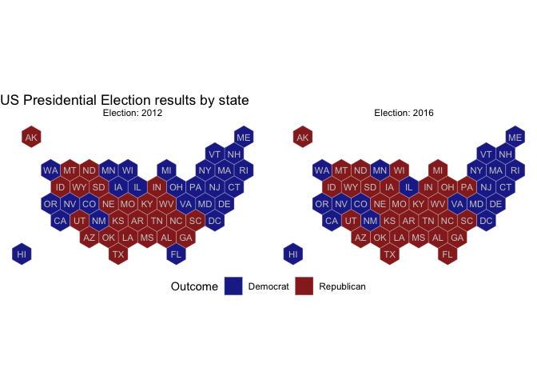
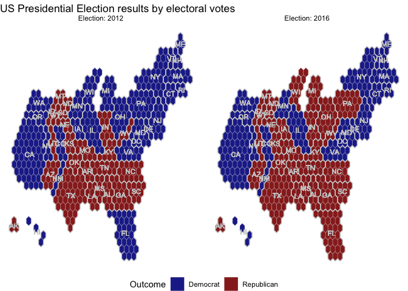

<!-- README.md is generated from README.Rmd. Please edit that file -->

# electionViz

<!-- badges: start -->

<!-- badges: end -->

R package for visualizations of election (or poll) results as easy as
adding `geom_electoral_building`.

## Installation

The development version from [GitHub](https://github.com/) with:

``` r
# install.packages("devtools")
devtools::install_github("heike/electionViz")
```

## Example

This is a basic example which shows you how to solve a common problem:

``` r
library(electionViz)
#> Loading required package: ggplot2
#> Loading required package: tilegramsR
#> Loading required package: sf
#> Warning: package 'sf' was built under R version 3.6.2
#> Linking to GEOS 3.7.2, GDAL 2.4.2, PROJ 5.2.0
#> Loading required package: elections
library(tidyverse)
#> ── Attaching packages ───────────────────────────────── tidyverse 1.3.0 ──
#> ✓ tibble  3.0.1     ✓ dplyr   1.0.0
#> ✓ tidyr   1.1.0     ✓ stringr 1.4.0
#> ✓ readr   1.3.1     ✓ forcats 0.5.0
#> ✓ purrr   0.3.4
#> Warning: package 'tibble' was built under R version 3.6.2
#> Warning: package 'tidyr' was built under R version 3.6.2
#> Warning: package 'purrr' was built under R version 3.6.2
#> Warning: package 'dplyr' was built under R version 3.6.2
#> ── Conflicts ──────────────────────────────────── tidyverse_conflicts() ──
#> x dplyr::filter() masks stats::filter()
#> x dplyr::lag()    masks stats::lag()

## basic example code
USelections %>% filter(year >= 2012) %>% glimpse()
#> Rows: 661
#> Columns: 14
#> $ year           <int> 2012, 2012, 2012, 2012, 2012, 2012, 2012, 2012, 2012, …
#> $ state          <chr> "Alabama", "Alabama", "Alabama", "Alabama", "Alaska", …
#> $ state_po       <chr> "AL", "AL", "AL", "AL", "AK", "AK", "AK", "AK", "AK", …
#> $ state_fips     <int> 1, 1, 1, 1, 2, 2, 2, 2, 2, 4, 4, 4, 4, 4, 5, 5, 5, 5, …
#> $ state_cen      <int> 63, 63, 63, 63, 94, 94, 94, 94, 94, 86, 86, 86, 86, 86…
#> $ state_ic       <int> 41, 41, 41, 41, 81, 81, 81, 81, 81, 61, 61, 61, 61, 61…
#> $ office         <chr> "US President", "US President", "US President", "US Pr…
#> $ candidate      <chr> "Romney, Mitt", "Obama, Barack H.", "", "", "Romney, M…
#> $ party          <chr> "republican", "democrat", "independent", "", "republic…
#> $ writein        <lgl> FALSE, FALSE, FALSE, TRUE, FALSE, FALSE, FALSE, FALSE,…
#> $ candidatevotes <int> 1255925, 795696, 18706, 4011, 164676, 122640, 7392, 29…
#> $ totalvotes     <int> 2074338, 2074338, 2074338, 2074338, 300495, 300495, 30…
#> $ version        <int> 20171015, 20171015, 20171015, 20171015, 20171015, 2017…
#> $ notes          <lgl> NA, NA, NA, NA, NA, NA, NA, NA, NA, NA, NA, NA, NA, NA…

elections <- USelections %>% 
  select(-office) %>%
  group_by(year, state, state_po) %>%
  mutate(percent = candidatevotes/totalvotes*100) %>%
  summarise(
    votes_dem = candidatevotes[party %in% c("democrat", "democratic-farmer-labor")],
    votes_rep = candidatevotes[party=="republican"],
    perc_dem = percent[party %in% c("democrat", "democratic-farmer-labor")],
    perc_rep = percent[party=="republican"],
    totalvotes = max(totalvotes),
    cand_dem = candidate[party %in% c("democrat", "democratic-farmer-labor")],
    cand_rep = candidate[party=="republican"],
    .groups = 'drop'
  )

# Merge geospatial and numerical information
ushex_plus <- ushex %>%
  left_join(elections, by="state")

centers <- ushex %>% select(centerX, centerY, abbr) %>% unique()
# Make a first chloropleth map
ushex_plus %>%
  filter(year >= 2012) %>%
  mutate(
    Election = year,
    Outcome = c("Republican", "Democrat")[as.numeric(perc_rep < perc_dem) + 1]) %>%
  ggplot() +
  geom_polygon(aes(fill =  Outcome, 
                   x = long, y = lat, group = group), 
               colour = "grey90", size = 0.1, alpha = 0.9) +
  scale_fill_manual(values = c("darkblue", "darkred")) +
  geom_text(aes(x = centerX, y = centerY, label = abbr), 
            colour = "grey80", size = 3, data = centers) +
  theme_void() +
  coord_map() +
  facet_wrap(~Election, labeller = "label_both") +
  theme(legend.position = "bottom") +
  ggtitle("US Presidential Election results by state")
```



``` r
# Merge geospatial and numerical information
electoral_hexplus <- electoral_hex %>%
  left_join(elections, by=c("state" = "state_po"))

# Make a first chloropleth map
electoral_hexplus %>%
  filter(year >= 2012) %>%
  mutate(
    Election = year,
    Outcome = c("Republican", "Democrat")[as.numeric(perc_rep < perc_dem) + 1]) %>%
  ggplot(aes(x = long, y = lat, group = group)) +
  geom_polygon(aes(fill =  Outcome), 
               colour = "grey90", size = 0.1, alpha = 0.9) +
  scale_fill_manual(values = c("darkblue", "darkred")) +
  geom_text(aes(x = centerX, y = centerY, label = state), 
            colour = "grey80", size = 3, 
            data = electoral_state_outline_hex) +
  geom_path(colour = "grey80", size = 0.5, 
            data = electoral_state_outline_hex) +
  theme_void() +
#  coord_map() +
  facet_wrap(~Election, labeller = "label_both") +
  theme(legend.position = "bottom") +
  ggtitle("US Presidential Election results by electoral votes")
```


