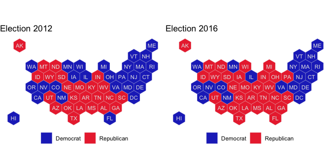
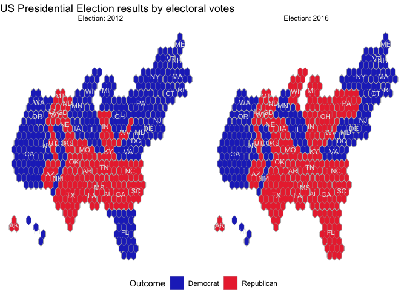
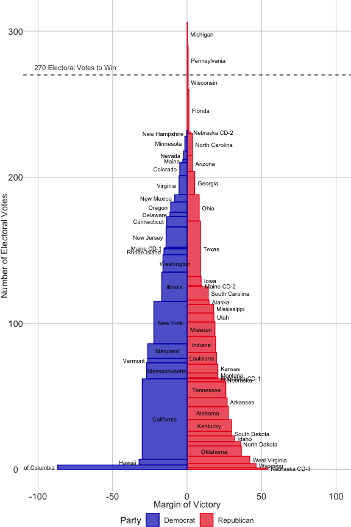
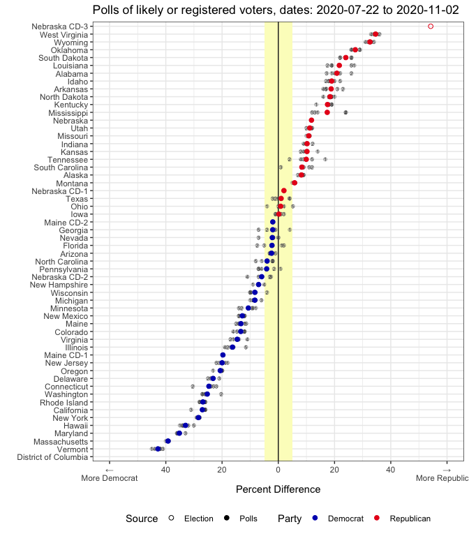
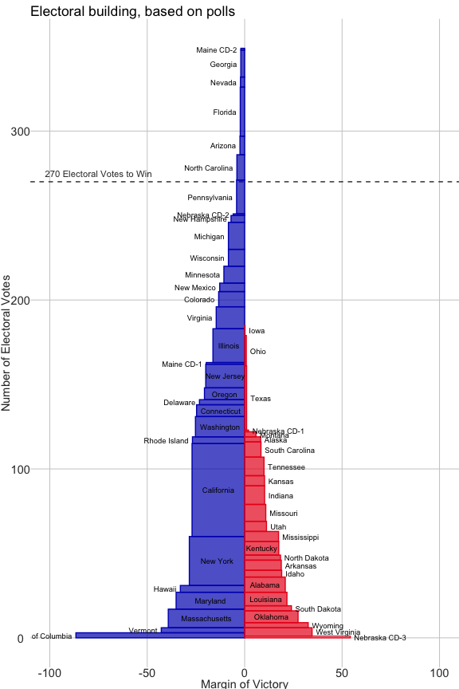
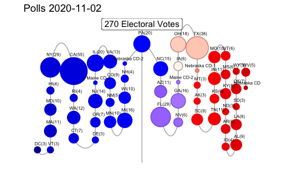

<!-- README.md is generated from README.Rmd. Please edit that file -->

# electionViz

<!-- badges: start -->

[](https://travis-ci.org/heike/electionViz)
<!-- badges: end -->

R package for visualizations of election (or poll) results as easy as
adding `geom_electoral_building`. While the geom is still in the
planning stages, several types of visualizations are implemented and
ready to use.

## Installation

The development version from [GitHub](https://github.com/) with:

``` r
# install.packages("devtools")
devtools::install_github("heike/electionViz")
```

## Example

We will be inundated with information about the state of the polls in
the build-up to the upcoming Presidential election of 2020.

With the tools of this package you will be able to pick your favorite
visualization(s) and explore the results your own way.

``` r
# load the package
library(electionViz)
library(tidyverse)
```

### Hexbin Cartogram of Election Results by State

Each state is represented by one hexagon. This map has been made
available by Andrew X Hill at
[CARTO](https://team.carto.com/u/andrew/tables/andrew.us_states_hexgrid/public/map).

``` r
data(elections)
el12 <- elections %>% filter(year == 2012)
gg12 <- hexplot(el12$state, el12$perc_rep > el12$perc_dem) +
  scale_fill_party("", labels=c("Democrat", "Republican")) +
  theme(legend.position = "bottom") +
  ggtitle("Election 2012")

el16 <- elections %>% filter(year == 2016)
gg16 <- hexplot(el16$state, el16$perc_rep > el16$perc_dem) +
  scale_fill_party("", labels=c("Democrat", "Republican")) +
  theme(legend.position = "bottom") +
  ggtitle("Election 2016")

gridExtra::grid.arrange(gg12, gg16, ncol=2)
```



### Hexbin Cartogram of the US Presidential Election by Electoral Votes

Each state is represented by a set of hexagons corresponding in number
to the state’s electoral votes. This map was adapted from the object
`sf_FiveThirtyEightElectoralCollege` in Bhaskar Karambelkar’s R package
[tilegramsR](https://github.com/bhaskarvk/tilegramsR).



### Electoral Building of the U.S. Presidential Election by Electoral Votes and Margin of Victory

“Electoral Building” diagram, inspired by a 2000 graphic from the New
York Times. Vote margin is represented on the x axis, while number of
electoral votes is represented in the height.



## Visualization of Polls

Accessing data of the most recent polls from RealClearPolitics or
FiveThirtyEight is done with functions `rcp_update()` or
`fivethirtyeight_update()` respectively. Each one of these functions has
a parameter `polls` to allow for a finer grained choice of which polls
to focus on:

``` r
new_polls <- fivethirtyeight_update(polls="president_polls")
new_polls %>% filter(!is.na(state)) %>%
  select(poll_id, start_date, end_date, pollster, state, candidate_name, pct)
#> # A tibble: 3,020 x 7
#>    poll_id start_date end_date   pollster         state    candidate_name    pct
#>      <dbl> <date>     <date>     <chr>            <chr>    <chr>           <dbl>
#>  1   67827 2020-07-16 2020-07-28 University of N… New Ham… Joseph R. Bide…    53
#>  2   67827 2020-07-16 2020-07-28 University of N… New Ham… Donald Trump       40
#>  3   67821 2020-07-23 2020-07-27 Monmouth Univer… Georgia  Joseph R. Bide…    47
#>  4   67821 2020-07-23 2020-07-27 Monmouth Univer… Georgia  Donald Trump       47
#>  5   67821 2020-07-23 2020-07-27 Monmouth Univer… Georgia  Jo Jorgensen        3
#>  6   67821 2020-07-23 2020-07-27 Monmouth Univer… Georgia  Joseph R. Bide…    47
#>  7   67821 2020-07-23 2020-07-27 Monmouth Univer… Georgia  Donald Trump       48
#>  8   67821 2020-07-23 2020-07-27 Monmouth Univer… Georgia  Jo Jorgensen        2
#>  9   67821 2020-07-23 2020-07-27 Monmouth Univer… Georgia  Joseph R. Bide…    46
#> 10   67821 2020-07-23 2020-07-27 Monmouth Univer… Georgia  Donald Trump       49
#> # … with 3,010 more rows
```

### Polls by State

The difference in percentage between democratic and republican
percentage of the last five polls (of likely or registered voters) for
each state are shown as grey points, colored points show average
difference for each point. States are ordered according to difference in
percentage. The yewllow rectangle shows a margin of +/- 5 percent - the
typical margin of error of a poll.

    #> Warning: Removed 1 rows containing missing values (geom_point).



### Building of polls

``` r
state_3 <- state_3 %>% filter(!(state %in% c("Maine", "Nebraska")))
electoral_building(
    state_district = state_3$state, 
    electoral_votes = state_3$electoral_votes, 
    perc_dem = state_3$perc_dem, 
    perc_rep = state_3$perc_rep,
    source = state_3$source) +
  scale_color_party("Party") +
  scale_fill_party("Party") +
  theme(legend.position = "none") +
  ggtitle("Electoral building, based on polls")
```



### A snake of beads

``` r
bead_snake_plot(
   electoral_votes_2016$state_district,
   electoral_votes_2016$electoral_votes,
   electoral_votes_2016$perc_dem,
   electoral_votes_2016$perc_rep, 
  height = 30, buffer = 3) +
  ggtitle("Election 2016")
#> Joining, by = "state_district"
```


    #> Joining, by = "state_district"


